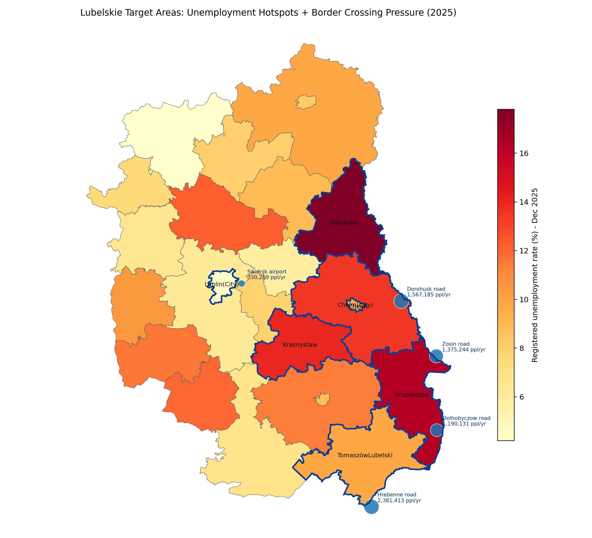
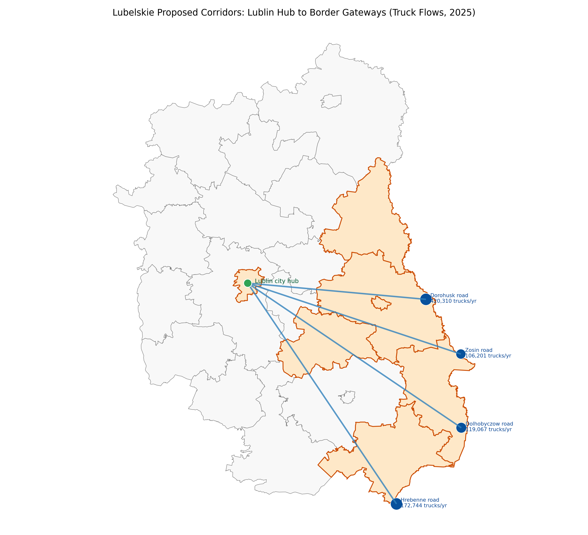

# Lubelskie 강력근거 팩 (지도+통계+정책근거)

## 결론(한 문장)
가능합니다. 그리고 이미 `사업 대상지 지도 + 공식 통계 + 기존 EU 집행사례`를 결합하면, "왜 하필 그 지역인지"를 상당히 강하게 설득할 수 있습니다.

---

## 1) 지도 증거 (바로 발표 삽입 가능)

### A. 실업 취약지 + 국경 통행 압력 결합 지도

- 파일: `references/maps/lubelskie_target_map_unemployment_border_2026-02-17.png`
- 근거 데이터:
  - `references/maps/lubelskie_unemployment_dec2025.csv` (GUS 2025-12)
  - `references/maps/nosg_crossings_annual_2025.csv` (NOSG 2025 월별 PDF 집계)

### B. Lublin 허브-국경거점 연결(화물차 흐름) 지도

- 파일: `references/maps/lubelskie_target_map_corridors_2026-02-17.png`
- 메시지: 접경 물류 압력이 큰 축에 교통·물류·인력전환 패키지를 배치하는 것이 합리적.

---

## 2) "왜 그 지역이어야만 하는가"에 대한 강한 근거

## 근거 1. 취약성의 공간 집중(실업)
- Lubelskie 평균 실업률(2025-12): `8.1%`
- 고실업 카운티:
  - `Włodawski 17.8%`
  - `Hrubieszowski 16.3%`
  - `Krasnostawski 14.0%`
  - `Chełmski 13.4%`
- 대비: `Lublin city 4.5%`

해석:
- "Lublin 단핵 성장"으로는 해결이 어렵고, 동부/접경 카운티에 직접 투자해야 분배개선 효과가 생김.

## 근거 2. 접경 충격의 실측 규모(인원/물류)
- 2025년 우크라이나 구간 통행량:
  - 인원 `7,316,228명/년`
  - 화물차 `818,322대/년`
- 도로 거점별 인원(연):
  - `Hrebenne 2,381,413`
  - `Dorohusk 1,567,185`
  - `Zosin 1,375,244`
  - `Dołhobyczów 1,190,131`
- 도로 거점별 화물차(연):
  - `Dorohusk 420,310`
  - `Hrebenne 172,744`
  - `Dołhobyczów 119,067`
  - `Zosin 106,201`

해석:
- 교통·물류 회복력 사업을 접경축에 우선 배치할 정량적 이유가 충분함.

## 근거 3. 정책 정합성(RIS + Cohesion)
- Lubelskie RIS 2030은 `quality food`, `green economy`, `healthy society`를 핵심 방향으로 제시.
- 현재 체계(ERDF/ESF+)에서 단기 파일럿 착수 가능, post-2027에서 다기금 확장 논리 성립.

해석:
- 제안사업(저탄소 이동/건물효율/전환일자리)은 지역 혁신·전환 전략과 정합적.

## 근거 4. 실행 가능성(실제 집행사례)
- Lubelskie 직접사례:
  - Q2706227 (Lublin 통합환승센터)
  - Q7370566, Q7370579 (저배출 대중교통)
  - Q7374678 (대규모 에너지효율/청정난방)
  - Q7370951, Q7370948 (Chełm/Hrubieszów 고용활성화)
- 유사환경/타지역 사례:
  - Q7375904 (Podkarpackie 저배출 철도차량)
  - Q7380717, Q7380718 (JTF 대형 연구·전환 인프라)

해석:
- "이론적으로만 가능한 사업"이 아니라, 이미 같은 제도권에서 집행된 유형.

## 근거 5. 전쟁 리스크-기회 동시 대응 필요
- 단기: 통행·물류 변동 대응(병목/서비스 불안정)
- 중기: 투자리스크 관리 + 재건수요 선점 준비
- 장기: Lubelskie의 재건지원 전진거점화 가능

해석:
- 해당 지역은 외부충격 민감도가 높아, 선제적 회복력 투자의 한계편익이 큼.

---

## 3) 발표에서 바로 쓰는 "강한 문장"

1. `We are not choosing these counties arbitrarily; we are targeting where structural unemployment and border-system pressure overlap.`
2. `In 2025 alone, the Ukraine-facing crossings handled over 7.3 million persons and 818 thousand trucks, which justifies corridor-level resilience investment.`
3. `Our package is place-based: Lublin as the capability hub, and Chełm-Hrubieszów-Włodawa-Tomaszów corridors as implementation frontlines.`
4. `This is not a speculative model; it follows funded precedents already implemented in Lubelskie and comparable eastern regions.`

---

## 4) 한계와 보강 포인트(정직한 방어)

- 한계:
  - post-2027 JTF의 Lubelskie 포함 여부는 아직 확정 아님.
- 보강:
  - 발표에서 `확정사실 vs 시나리오`를 분리 표기.
  - JTF 미포함 시 `ERDF+ESF+ 대체 시나리오`를 동일 슬라이드에 병기.

---

## 5) 지정학 위기 인접지에서도 집행된 공식 선례 (발표 설득용)

## 선례 A. 전쟁 인접 Interreg 예산을 EU가 공식 승인/확대
- European Commission(2022-12-02) 발표:
  - 우크라이나·몰도바 포함 4개 Interreg 프로그램에 `EUR 533m` 승인
  - `Poland-Ukraine EUR 187m`, `Romania-Ukraine EUR 54m` 포함
  - 러시아/벨라루스 협력 중단 후 `EUR 26.2m`를 우크라이나·몰도바 협력으로 재배치

해석:
- 지정학 위기 상황에서도 EU는 단순 중단이 아니라 `재배치 + 우선지원`으로 대응한 선례가 있음.

## 선례 B. Poland-Ukraine 프로그램은 전쟁 중에도 실제 집행 계속
- Interreg NEXT PL-UA 공식 페이지:
  - EC 채택일 `2022-11-30`
  - EU 배정 `EUR 235.9m` (프로젝트 최소 `EUR 214.4m`)
- 2025년 기준 공식 프로젝트 DB:
  - Monitoring Committee 선정 `72개 프로젝트`
  - `Bridge850PL-UA`, `SafeRoad4All`, `DriveConnect`, `CrossBorderRoads` 등 도로·접근성 사업 포함
- 폴란드 정부(2025-10-08) 공식 발표:
  - 폴란드-우크라이나 접경 신규 6개 프로젝트에 `EUR 57.6m` 결정

해석:
- "접경 불안정 때문에 투자 불가"가 아니라, `접경 회복력 프로젝트를 오히려 우선 배치`한 실집행 선례가 확인됨.

## 선례 C. Romania-Ukraine 프로그램도 2024-2025 콜/계약 지속
- 공식 프로그램 사이트(Managing Authority 공지):
  - 2차 small-scale 콜(2025-04-28 오픈, 예산 `EUR 15,605,083`)
  - 2차 콜 접수 `103건`(2025-07-29 공지)
  - 2025-08-07 기준 `49개 프로젝트`, 총 `EUR 39,458,008.66` 계약 완료 공지

해석:
- 전쟁 인접권에서도 `콜 오픈 -> 평가 -> 계약`의 프로그램 사이클이 실제로 작동하고 있음.

## 선례 D. HUSKROUA도 2025년에 2차 콜 오픈
- Interreg VI-A NEXT Hungary-Slovakia-Romania-Ukraine 공식 공지:
  - 2차 콜 2025-09-05 시작
  - EU 기여금 `EUR 28.5m`
  - 인프라 포함 정규 프로젝트 접수기한은 2026-02-15로 공지되었고, 이후 2026-02-26까지 연장 공지됨

해석:
- 분쟁 인접 다국경 프로그램도 `단년도 단발성`이 아니라 `연속 라운드`로 운영 가능함.

## 선례 E. Solidarity Lanes: 고위험 접경 연결에 대규모 CEF 투입
- EC Transport 공식 페이지:
  - Solidarity Lanes 관련 동원액 `EUR 2.3bn+`
  - 이 중 CEF 무상보조 `EUR 1.55bn`
  - `38개` 교통 프로젝트를 통해 EU-우크라이나 연결성 강화

해석:
- 지정학 리스크가 큰 접경축일수록, 전략적 연결성 프레임으로 대형 공공재원 유치가 가능함.

## 선례 F. (비EU 지역) 분쟁 상황에서도 공공 패키지 집행: Palestine
- European Commission(2025-04-14):
  - 2025-2027 회복·회복탄력 패키지 `최대 EUR 1.6bn`
- EIB(2025-09-24):
  - 같은 프레임 내 민간부문 금융접근용 `EUR 400m` 금융시설 서명

해석:
- 분쟁/불안정 환경 자체가 공공지원 배제 사유가 아니라, `거버넌스+회복탄력+민간생태계` 결합 설계로 자금집행이 가능함.

## 발표에서 바로 쓰는 문장(추가)
- `European precedents show that geopolitical risk is not a disqualifier; it is a design parameter for resilient cross-border investment.`
- `In war-adjacent corridors, programmes have continued through calls, contracting, and infrastructure delivery, which supports our phased Lubelskie strategy.`

---

## 6) 출처

- GUS (Dec 2025 unemployment by powiat, XLSX):
  - https://stat.gov.pl/obszary-tematyczne/rynek-pracy/bezrobocie-rejestrowane/bezrobotni-zarejestrowani-i-stopa-bezrobocia-stan-w-koncu-grudnia-2025-r-,2,161.html
  - https://stat.gov.pl/download/gfx/portalinformacyjny/pl/defaultaktualnosci/5473/2/161/1/liczba_bezrobotnych_i_stopa_bezrobocia_12_2025.xlsx
- NOSG statistics (2025 monthly PDFs):
  - https://nadbuzanski.strazgraniczna.pl/nos/komenda/granice/statystyki/2025
- OECD 2025 Lubelskie attractiveness report (repo PDF)
- RIS 2030 Lubelskie (repo PDF)
- Kohesio project database:
  - https://kohesio.ec.europa.eu/en/
- EU Cohesion policy with Ukraine/Moldova (`EUR 533m`, 2022-12-02):
  - https://enlargement.ec.europa.eu/news/eu-cohesion-policy-over-eu530-million-territorial-cooperation-including-ukraine-and-moldova-2021-2022-12-02_en
- Interreg NEXT Poland-Ukraine official programme page:
  - https://pl-ua.eu/en/programme/about-the-programme/
- Interreg NEXT Poland-Ukraine projects database (`72 projects selected so far`):
  - https://pl-ua.eu/en/projects-database/
- Poland government release on `EUR 57.6m` new PL-UA projects (2025-10-08):
  - https://www.gov.pl/web/fundusze-regiony/ponad-576-mln-euro-na-infrastrukture-i-wspolprace-na-polsko-ukrainskim-pograniczu
- Interreg NEXT Romania-Ukraine official call/contract notices:
  - https://ro-ua.net/en/comunication-2021-2027/noutati-2021-2027/1662-launching-of-the-second-call-for-small-scale-projects-within-the-interreg-next-vi-a-romania-ukraine-programme-2021-2027
  - https://ro-ua.net/en/comunication-2021-2027/noutati-2021-2027/1698-great-interest-in-the-2nd-call-for-small-scale-projects
  - https://ro-ua.net/en/comunication-2021-2027/noutati-2021-2027/1701-the-managing-authority-of-the-interreg-next-via-romania-ukraine-2021-2027-programme-announces-the-completion-of-the-contracting-process-for-the-projects-approved-by-the-programme-monitoring-committee
- Interreg VI-A NEXT HUSKROUA 2nd call (2025):
  - https://next.huskroua-cbc.eu/calls/2nd-call-for-proposals/
- EC Transport, EU funding for Solidarity Lanes:
  - https://transport.ec.europa.eu/ukraine/eu-ukraine-solidarity-lanes/eu-funding-better-transport-connections_en
- European Commission Palestine package (`up to EUR 1.6bn`, 2025-2027):
  - https://north-africa-middle-east-gulf.ec.europa.eu/news/commission-announces-multiannual-programme-palestinian-recovery-and-resilience-worth-eu16-billion-2025-04-14_en
- EIB-EC Palestine facility (`EUR 400m`, 2025-09-24):
  - https://www.eib.org/en/press/all/2025-346-eib-and-european-commission-support-palestine-s-economic-resilience-with-eur400-million-facility-for-local-businesses
